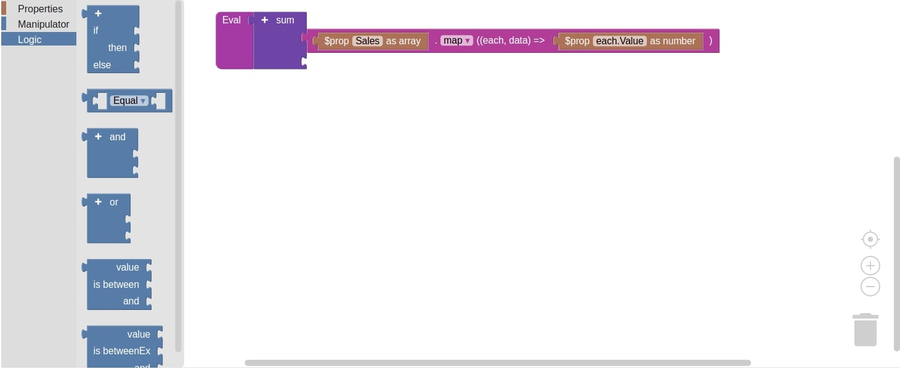

# qz-evaluator



# DOM

Logic block composer interface

## Installation and usage

Download `index.min.js` from `frontend/dist/index.min.js`.

Usage in browser:

```javascript
const evaluator = QzEvaluatorDom.render(
    document.getElementById('evaluator'), 
    {
        autosave: true,
        readonly: false,
    }
);
let logicBlock = evaluator.getValue();
```

## API

### render

Initiate evaluator dom

```javascript
_.render(domElement, option);
```

Arguments:

| argument        | type                                  | description                            |
| --------------- | ------------------------------------- | -------------------------------------- |
| domElement      | DOM Element                           | DOM element to render evaluator dom    |
| option.autosave | boolean                               | if true, evaluator will save changes to localstorage |
| option.readonly | boolean                               | if true, no changes can be made on dom |
| option.evalMode | "", "boolean", "number"               | determine which can be accepted as return value. Supported value is boolean, number or empty (all variable type) |


Returns:

```
QzEvaluator block object
```

Example:

```javascript
const evaluator = QzEvaluatorDom.render(
    document.getElementById('evaluator'), 
    {
        autosave: true,
        readonly: false,
    }
);
```

### evaluator.getValue

Get logic blocks as JSON

```javascript
evaluator.getValue();
```

Returns:

```
Logic block in JSON format
```

Example:
```javascript
let logicBlock = evaluator.getValue();
/*
{ $prop_number: "myValue" }
*/
```

### evaluator.getYAML

Get logic blocks as YAML
```javascript
evaluator.getYAML();
```

Returns:

```
Logic block in YAML format
```

Example:
```javascript
let logicBlock = evaluator.getYAML();
/*
$prop_number: "myValue"
*/
```

### evaluator.parseJSON

Parse logic block in JSON format
```javascript
evaluator.parseJSON(json);
```

Arguments:

| argument        | type  | description                            |
| --------------- | ----- | -------------------------------------- |
| json            | JSON  | logic block                            |

Example:
```javascript
evaluator.parseJSON({ $prop_number: "myValue" });
```

### evaluator.parseYAML

Parse logic block in YAML format
```javascript
evaluator.parseYAML(yaml);
```

Arguments:

| argument        | type    | description                            |
| --------------- | ------- | -------------------------------------- |
| yaml            | string  | logic block                            |

Example:
```javascript
evaluator.parseYAML(`$prop_number: "myValue"`);
```

# Evaluator

Data evaluator based on logic block composed from DOM

## Installation and usage

Installation using npm

```shell
npm i @fendy3002/qz-evaluator
```

Installation using yarn
```shell
yarn add @fendy3002/qz-evaluator
```

Usage in Node.js:

```javascript
import { fromJSON } from '@fendy3002/qz-evaluator';

let logicBlock = {
    "$m_sum": [
        {
            "$array_handle": {
                "source": {
                    "$prop_array": "Sales"
                },
                "operation": "map",
                "handler": {
                    "$prop_number": "each.Value"
                }
            }
        }
    ]
};
let data = {
    "FirstName": "Brad",
    "LastName": "Gibson",
    "Birth": "1993-07-20",
    "Rank": 3,
    "Sales": [
        { "Month": 0, "Value": 1000 },
        { "Month": 1, "Value": 1500 },
        { "Month": 2, "Value": 2000 },
        { "Month": 3, "Value": 3000 }
    ]
};

let evaluationResult = fromJSON(logiBlock).evaluate(data); // 7500
```

## API

### fromJSON

Create evaluator from JSON logic block

```javascript
fromJSON(logicBlockJSON);
```

Arguments:

| argument        | type  | description                |
| --------------- | ------| -------------------------- |
| logicBlockJSON  | JSON  | Logic block in JSON format |

Returns:

```
QzEvaluator object
```

Example:

```javascript
const evaluator = fromJSON({ $prop_number: "myValue" })
```

### fromYAML

Create evaluator from YAML logic block

```javascript
fromYAML(logicBlockYAML);
```

Arguments:

| argument        | type           | description                |
| --------------- | -------------- | -------------------------- |
| logicBlockYAML  | string (YAML)  | Logic block in YAML format |

Returns:

```
QzEvaluator object
```

Example:

```javascript
const evaluator = fromYAML(`$prop_number: "myValue"`)
```

### evaluator.evaluate

Evaluate JSON data against pre-supplied logic block

```javascript
evaluator.evaluate(data);
```

Arguments:

| argument        | type           | description                  |
| --------------- | -------------- | ---------------------------- |
| data            | JSON           | data to be evaluated against |

Returns:

```
Evaluation result
```

Example:

```javascript
let data = {
    "myValue": 9300
};
fromJSON({ $prop_number: "myValue" }).evaluate(data) // 9300
```